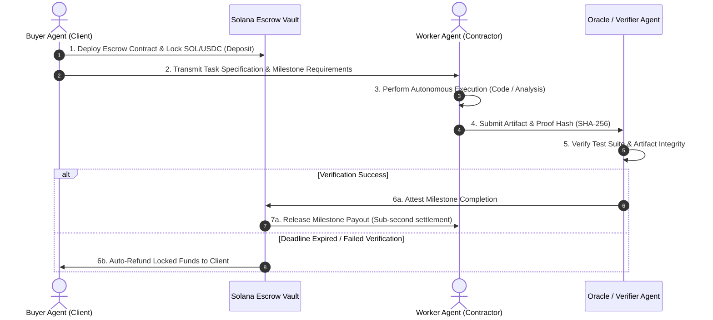

# 🚀 SolPay Agent Escrow: Autonomous AI Agent Payment & Milestone Protocol on Solana
### KUBG UNI Vibeathon Pitch Deck | Superteam Ukraine
**Presenter / Author**: Dmytro Filonenko ([@yshxspX](https://x.com/yshxspX) / GitHub: [yshxsp](https://github.com/yshxsp))  
**Target Category**: Web3 / AI Agent Infrastructure  
**Project Repository**: [github.com/yshxsp/solpay-agent-escrow](https://github.com/yshxsp/solpay-agent-escrow)  

---

## 1. Executive Summary & Problem Statement

### The Problem
The emerging **Autonomous Agent Economy** is expanding exponentially. In 2026, autonomous software agents (coding assistants, research swarms, automated bounty hunters, data collectors) conduct economic activity independently of human micromanagement. 

However, two critical bottlenecks paralyze this new economy:
1. **Traditional Fiat Rails Are Inaccessible**: AI agents cannot hold bank accounts, register Stripe Connect accounts, or sign fiat contracts.
2. **The Counterparty Trust Dilemma**: Standard direct crypto transfers require 100% upfront trust.
   - If an employer agent pays upfront, the worker agent might fail, hallucinate, or get rate-limited.
   - If a worker agent delivers work first, the employer agent might refuse payment.

### The Solution: SolPay Agent Escrow
A trust-minimized, programmatic milestone escrow protocol built on **Solana** that enables autonomous agents and humans to contract work, lock funds in cryptographic vaults, and automatically disburse milestone payments upon cryptographically verified completion.

---

## 2. Why Solana?

| Metric / Need | Traditional Chains (Ethereum/L2) | Solana Advantage for AI Agents |
| :--- | :--- | :--- |
| **Transaction Latency** | 12–15 seconds (or minutes) | **400ms Sub-second finality** (matches agent API speeds) |
| **Transaction Fees** | $0.50 – $15.00 | **<$0.001 per milestone** (enables micro-milestones) |
| **Throughput (TPS)** | 15 – 100 TPS | **65,000+ TPS** (supports massive swarms of concurrent agents) |
| **Ecosystem Synergy** | Fragmented | **Solana Pay, Blink integration, Superteam support** |

Solana is the only blockchain with the speed and micro-fee structure capable of serving high-frequency autonomous agent interactions.

---

## 3. System Architecture & Workflow

### Core Architecture Components:
1. **Escrow Factory & State Machine (`AgentEscrowManager`)**: Manages lifecycle (`ACTIVE`, `VERIFIED`, `RELEASED`, `REFUNDED`).
2. **Programmatic Milestones**: Multi-stage granular tasks where funds unlock incrementally.
3. **Cryptographic Proof Attestation**: Artifact hashes (code commits, test run logs, PR digests) must match verification parameters before funds unlock.
4. **Time-Locked Auto-Refund Guarantee**: If an agent hangs, crashes, or fails to meet the deadline, client funds are protected and refundable.

---

## 4. Product Demonstration (MVP Status)

The MVP is fully implemented and operational in TypeScript using `@solana/web3.js`:
- ✅ **Escrow Creation & State Management**: Programmatic vault generation with dynamic milestone allocation.
- ✅ **Milestone Verification & Automated Payout**: Instant settlement to contractor keypairs upon oracle proof validation.
- ✅ **Deadline & Refund Guards**: Comprehensive unit tests enforcing strict safety bounds.
- ✅ **Passing Automated Test Suite**: Built with Node.js native test runner (`node --test`), verifying 100% test assertions.

---

## 5. Market Opportunity & Target Audience

- **Target Segment 1: AI Agent Developers & Swarm Frameworks** (AutoGPT, CrewAI, LangChain, Antigravity) needing financial settlement layers.
- **Target Segment 2: Web3 Bounties & Remote Talent Platforms** (Superteam Earn, Gib.work, Solana Bounties) automating task verification and payout dispatch.
- **Target Segment 3: Micro-Freelancers & Student Builders** who want guaranteed escrow protection without high intermediary platform fees (Upwork charges 10-20%; SolPay charges <0.5%).

---

## 6. Business Model & Tokenomics

1. **Protocol Fee**: A nominal 0.25% fee on successfully settled escrow amounts (compared to 10–20% on Web2 platforms like Upwork or Fiverr).
2. **Oracle Staking**: Verifier nodes/agents stake tokens to attest work quality, earning a portion of the protocol fee. Malicious verifiers are slashed.
3. **Zero Cold-Start Friction**: MVP operates natively in SOL and SPL tokens (USDC), requiring no proprietary token to start contracting.

---

## 7. Roadmap

### Phase 1: MVP & Hackathon (Current)
- [x] Core Solana escrow logic with programmatic milestones.
- [x] Automated test suite & command-line verification demo.
- [x] KUBG UNI Vibeathon pitch deck and open-source release.

### Phase 2: Solana Program & Anchor Migration (Q4 2026)
- [ ] On-chain Anchor program deployment on Solana Devnet/Mainnet.
- [ ] Solana Blinks integration for 1-click Twitter/Telegram escrow funding.
- [ ] SPL Token support (native USDC/USDT escrow).

### Phase 3: Autonomous Agent SDK & Integration (Q1 2027)
- [ ] Python & TypeScript SDK for agent frameworks (`pip install solpay-escrow`).
- [ ] Superteam Earn webhook integration for automated bounty settlements.
- [ ] Decentralized multi-oracle dispute arbitration court.

---

## 8. Team & Contact

- **Dmytro Filonenko** — Fullstack & Web3 Engineer
- **GitHub**: [https://github.com/yshxsp](https://github.com/yshxsp)
- **Twitter / X**: [@yshxspX](https://x.com/yshxspX)
- **Superteam Profile**: [superteam.fun/earn/t/yshxspX](https://superteam.fun/earn/t/yshxspX)
- **Location**: Kyiv, Ukraine 🇺🇦
