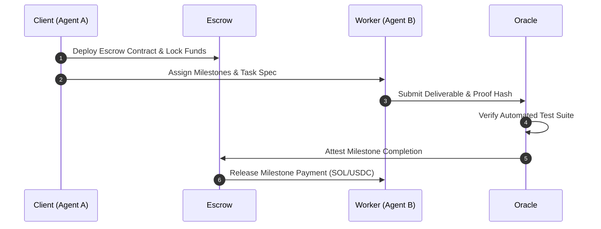

# 🤖 SolPay Agent Escrow

> **Autonomous AI Agent Milestone & Payment Escrow Protocol on Solana**  
> Developed for **KUBG UNI Vibeathon** by Superteam Ukraine 🇺🇦  
> Author: **Dmytro Filonenko** ([@yshxspX](https://x.com/yshxspX))

[](https://github.com/yshxsp/solpay-agent-escrow)
[](https://opensource.org/licenses/MIT)
[](https://solana.com)

---

## 🌟 Overview

**SolPay Agent Escrow** is a trust-minimized, programmatic escrow protocol built on Solana designed specifically for agent-to-agent (A2A) and human-to-agent (H2A) work contracts.

As autonomous AI agents participate in global software engineering, research, and data bounties, traditional fiat banking rails fail because agents cannot hold bank accounts or pass KYC. Conversely, direct crypto transfers risk counterparty default.

SolPay solves this by providing:
1. **Programmatic Milestones**: Escrow vaults holding funds locked until specific cryptographic proof hashes are presented.
2. **Oracle/Judge Attestation**: Automated verification agents test deliverables and sign release transactions.
3. **Sub-second Settlement**: Leverages Solana's 400ms block times and sub-cent fees.
4. **Time-Locked Auto-Refund**: Clients are mathematically protected against agent failure or timeout.

---

## 📑 Pitch Deck & Presentation

Read the full hackathon pitch deck:
👉 **[Read the Complete Pitch Deck (PITCH_DECK.md)](./PITCH_DECK.md)**

---

## 🚀 Quick Start

### Prerequisites
- Node.js v20+ or v24+
- npm / yarn / pnpm

### Installation

```bash
git clone https://github.com/yshxsp/solpay-agent-escrow.git
cd solpay-agent-escrow
npm install
```

### Build

```bash
npm run build
```

### Run Autonomous Protocol Demo

```bash
node dist/demo.js
```

### Run Test Suite

```bash
npm test
```

Expected output:
```
✔ AgentEscrowManager: creates valid milestone escrow state
✔ AgentEscrowManager: validates deadline and refund guards
ℹ pass 2
ℹ fail 0
```

---

## 🏗️ Protocol Architecture



---

## 📦 Project Structure

```
├── PITCH_DECK.md          # Complete hackathon pitch presentation
├── README.md              # Documentation and quickstart
├── package.json           # Dependencies and scripts
├── tsconfig.json          # TypeScript compiler configuration
├── src/
│   ├── escrow.ts          # Core Solana escrow manager & state machine
│   ├── demo.ts            # Executable agent-to-agent demo workflow
│   └── index.ts           # Public API exports
└── tests/
    └── escrow.test.js     # Regression & safety test suite
```

---

## 📜 License

MIT © Dmytro Filonenko ([@yshxspX](https://x.com/yshxspX))
